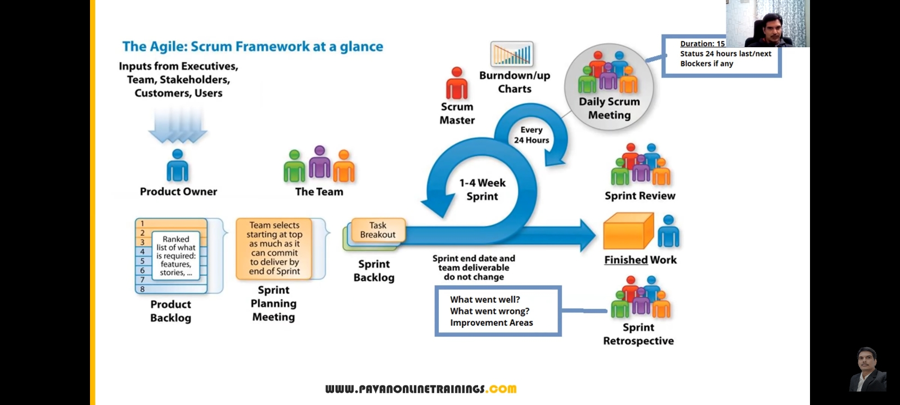

# <a href="https://www.youtube.com/watch?v=h2Xzq2fbafM">Module-3(Part-1)</a>

Topics:-
1) Agile Model
2) Agile Methodology
3) Scrum Process

Agile model /Agile methodology /Agile process:
==

- It is an Iterative (example like spiral model [same process we are repetating #again-and-again]) and Incremental (we keep on adding new feature) Approach.
- Agile is an Iterative and Incremental Process.
    - ex:- Suppose a customer want one project with 100 features then
    **customer NO need to wait till the project is completed/developed**.
        - we release small bits and pieces of the software to customer in this method.
        - we will be developing again 10 new features and test them and deliver to the customer, and we do it till all customer 100 features are developed. 
        - **we will be delevering the piece of software with some features/functionalities which are tested**
        - **We can accomodate the changes** from the customer as in ongoing project customer will come up with new features(extra features) 
- Agile Principle:-
    - Customer NO need to wait till the project is completed/developed
    - We develop, test and release piece of software to the customer with few no. of features.
    - We can accept/accomodate requirement changes.

- In agile process there is a good communication between **Developer, Business Analyst, QA(tester) & Customer** as they collectively work for common GOAL(provide quality product to the customer).
- Requirement are discussed in meeting and less documentation in this proces.

Advantages & Disadvantages
==
- Advantages
    - Requirement changes are allowed in any stage of developement (or) we can accommodate requirement changes in the middle of developement.
    - Release will be very fast (weekly).
    - Customer NO need to wait for long time.
    Good Communication between team.
    - It is very easy model to adopt.

- Disadvantages
    - Less focus on design and documentation since we deliver software very faster.

Scrum
==
Note:- 
1) Agile is the process model.
2) Agile and scrum are different.

- Scrum is a kind of framework through which we will develope and test software and finally we release it to the customer. 
- agile define the process/principles, how the process should be! and scrum helps us to follow the process/principle so,..
- **Scrum is a framework through which we build software product by following Agile Principle.**

### Scrum Team 
Scrum includes group of people called Scrum team. Normally contains 5-9 members.
1) Product Owner
2) Scrum Master
3) Dev Team
4) QA Team

### ROLE & RESPONSIBILITY:- 
1) Product Owner
    - Define the features of the product
    - Prioritize features according to market value
    - Adjust features and priority every iteration, as needed
    - Accept or reject work result.

2) Scrum Master
    - The main role is facilitating and driving the agile process.
        - he/she knows entire agile process, activity, drive the process.
        - he/she make sure all in team follow this process and make awareness if someone don't know.

3) Developer and QA :-
    - Develope and Test the software

Scrum Terminology
==
product owner will prepare below while interacting with customer.
- **User story** : A feature/module in a software 
- **Epic** : Collection of user stories.
- **Product backlog** : Contains list(excel document) of user stories. Prepared by product owner at begining of the agile process.
- **Sprint/Iteration** : Period/span of time to complete the user stories, decided by the **product owner and team**, usually 2-4 weeks of time.

Entire **TEAM** will be included in below
- **Sprint Planning meeting** : Meeting conducts with the **team** to define what can be delivered in the sprint and duration.

- **Sprint backlog** : List of commited(few) stories by **Dev/QA** for specific sprint.

- **Sprint meeting** : Meeting conducted **by Scrum Master** everyday 15-min. Called as scrum-call/Standup meeting.

    - What did you do Yesterday?
    - What will you do today?
    - Are there any impediments/blocker in your way?

- **Sprint retrospective meeting** : Conduct meeting after completing of every sprint. **The entire team**, including both the scrumMaster and the product owner should participate.
    - what went well and what went wrong in previous sprint we have to discuss and what new improvement in new sprint we have to perform we should tell.

- **Story point** : Rough estimation of user stories, will be given by Dev & QA in the form of Fibonacci series.
    - 0 1 1 2 3 5 8 .......

    > example:-     
    > 1 story pint = 1 hour/ 1 day(6 hours) 
    >
    > Login ------> Dev-5     QA-3 = 8 hours/1 day

- **Burndown chart** : Shows how much work remaining in the sprint. Maintained by the **scrum master** daily.

<!-- -- pic taken in mobile -->

Scrum Process
==
click below to watch the timed-based-video (exact time-stamp) as it has PPT @overview of entire process

<a href="https://www.youtube.com/watch?v=h2Xzq2fbafM&t=53m">click here</a>